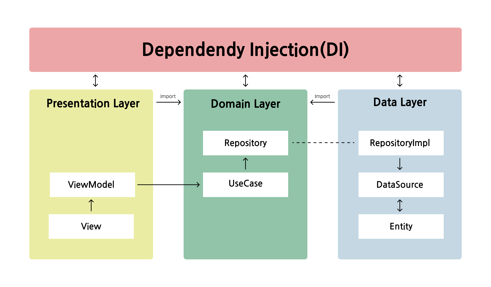
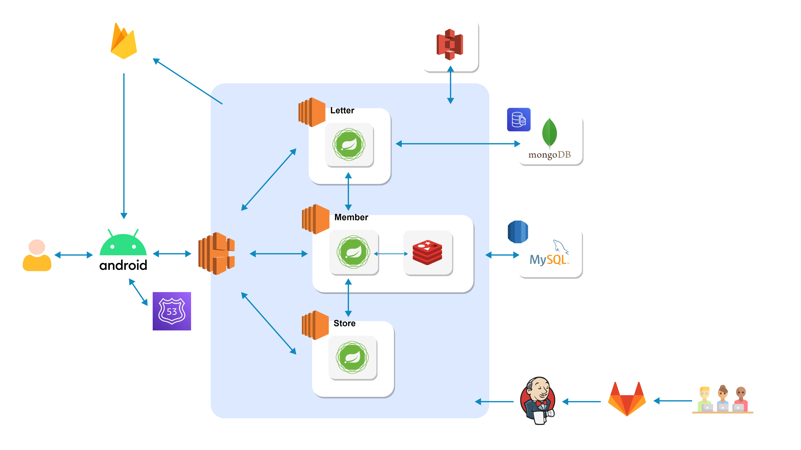
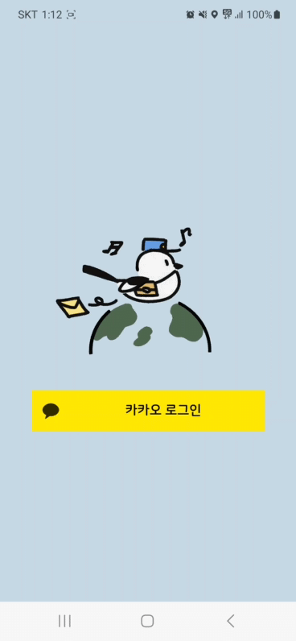
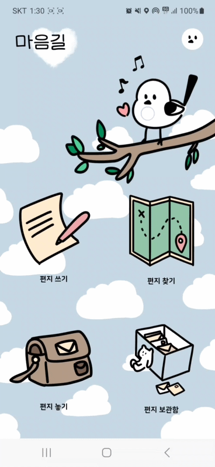
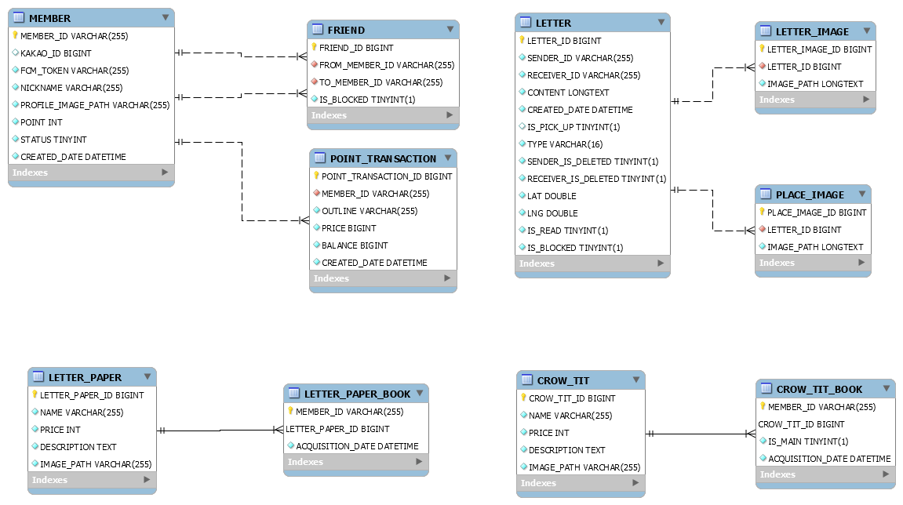

# 💌 당신의 마음을 가지러 가는 길, 마음길


```
📢 SSFAY 9기 2학기 자율프로젝트
📢 구미2반 D203
📢 23.10.10 ~ 23.11.17 (총 6주)
```

<br/>

---

# 📬 1. 마음길 소개

### 누군가에게 마지막으로 편지를 보냈던적이 언제인가요?
이메일, 카카오톡, 인스타그램 등 현재의 SNS는 메시지를 보내는 즉시 상대방에게 전달되어 즉각적인 소통이 가능합니다. 하지만 사람들마다의 생김새가 다르듯 사람마다 고유한 글씨체를 통한 약간의 번짐, 미세한 떨림 등이 느껴지는 비언어적인 요소가 느껴지는 손글씨 가득한 편지처럼 내용 이상의 것을 SNS로는 느낄 수 없습니다.
텍스트 이상의 감동을 전하고 일상 속 지나다니는 길에서 나를 위한 편지를 발견하고 일상 속의 아날로그 감성을 채워보세요. 

<br/>

---

<br/>

# 📬 2. 개발 환경

## 2-1. 환경설정

### 📱 **Android**


<br/>

### 💻 **Backend**


### ⚙ **CI/CD**


![amazonrds](https://img.shields.io/badge/amazonelb-FF9900.svg?style=for-the-badge&logo=&logoColor=white)


### 🤝 **Collaboration Tools**


## 2-2. 서비스 아키텍쳐

### 📱 **Android**



### 💻 **Backend**



<br/>

---

<br/>

# 📬 3. 주요 기능


| 소셜 로그인 | 손글씨 편지 작성 |
|:-------------------------:|:-------------------------:|
|  |  |

| 타이핑 편지 작성 | 상점 |
|:-------------------------:|:-------------------------:|
|  |  |

| 마이페이지 | 캐릭터 도감 |
|:-------------------------:|:-------------------------:|
|  |  |

| 편지 두기 | 편지 줍기 |
|:-------------------------:|:-------------------------:|
|  |  |

| 받은 편지 보관함 |
|:-------------------------:|
|  |


<br/>

---

<br/>

# 📬 4. 프로젝트 산출물

## 4-1. ERD

  


## 4-2. [Figma](https://www.figma.com/file/ablGJm1NuXHtz300aC6Z9t/HeartPath?type=design&node-id=0-1&mode=design&t=xULcMPGSldVsEDUt-0)

## 4-3. [요구사항명세서](https://tartan-morning-592.notion.site/78e117e59bf7419bab705db37c486d17?pvs=4)

<br/>

---

<br/>

# 👩‍👦‍👦 5. 팀 소개

|                   Android                    |                   Android                    |                   Android                    |                   Back end                   |                   Back end                   |                   Back end                    |
| :------------------------------------------: | :------------------------------------------: | :------------------------------------------: | :------------------------------------------: | :------------------------------------------: | :-------------------------------------------: |
|                    김도연                    |                    하동혁                    |                    황신운                    |                    김민수                    |                    이연지                    |                    조혜진                     |
