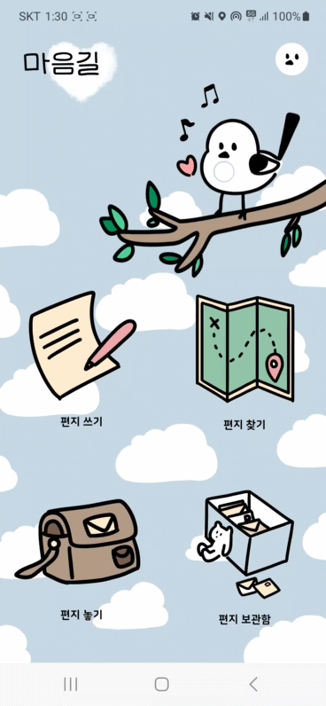

# 💌 당신의 마음을 가지러 가는 길, 마음길


```
📢 SSFAY 9기 2학기 자율프로젝트
📢 구미2반 D203
📢 23.10.10 ~ 23.11.17 (총 6주)
```

<br/>

---

# 📬 1. 마음길 소개

### 누군가에게 마지막으로 편지를 보냈던적이 언제인가요?
이메일, 카카오톡, 인스타그램 등 현재의 SNS는 메시지를 보내는 즉시 상대방에게 전달되어 즉각적인 소통이 가능합니다. 하지만 사람들마다의 생김새가 다르듯 사람마다 고유한 글씨체를 통한 약간의 번짐, 미세한 떨림 등이 느껴지는 비언어적인 요소가 느껴지는 손글씨 가득한 편지처럼 내용 이상의 것을 SNS로는 느낄 수 없습니다.
텍스트 이상의 감동을 전하고 일상 속 지나다니는 길에서 발견하는 나를 위한 편지를 발견하고 일상 속의 아날로그 감성을 채워보세요. 

<br/>

---

<br/>

# 📬 2. 개발 환경

## 2-1. 환경설정

### 📱 **Android**


![T Map](https://img.shields.io/badge/T%20Map-783BFF?&style=for-the-badge&logo=data:image/svg+xml;base64,PHN2ZyB4bWxucz0iaHR0cDovL3d3dy53My5vcmcvMjAwMC9zdmciIHhtbG5zOnhsaW5rPSJodHRwOi8vd3d3LnczLm9yZy8xOTk5L3hsaW5rIiB3aWR0aD0iNjkuOTAyIiBoZWlnaHQ9IjY5LjkwMiIgdmlld0JveD0iMCAwIDY5LjkwMiA2OS45MDIiPjxkZWZzPjxjbGlwUGF0aCBpZD0iYSI+PHBhdGggZD0iTTAsLjIxVjE1Ljc2M0g2OS45Vi4yMVoiIHRyYW5zZm9ybT0idHJhbnNsYXRlKDAgLTAuMjEpIiBmaWxsPSJub25lIi8+PC9jbGlwUGF0aD48Y2xpcFBhdGggaWQ9ImIiPjxyZWN0IHdpZHRoPSI2OS45MDIiIGhlaWdodD0iMTUuNTUzIiBmaWxsPSJub25lIi8+PC9jbGlwUGF0aD48Y2xpcFBhdGggaWQ9ImMiPjxwYXRoIGQ9Ik00NC44NzQuMjFBMzEuMTA3LDMxLjEwNywwLDAsMCwxMy43NjYsMzEuMzE2djM4LjhIMjkuMzIxVjMxLjMxOEExNS41NTIsMTUuNTUyLDAsMCwxLDQ0Ljg3NCwxNS43NjNINTYuNDk1Vi4yMVoiIHRyYW5zZm9ybT0idHJhbnNsYXRlKC0xMy43NjYgLTAuMjEpIiBmaWxsPSJub25lIi8+PC9jbGlwUGF0aD48Y2xpcFBhdGggaWQ9ImQiPjxyZWN0IHdpZHRoPSI0Mi43MjkiIGhlaWdodD0iNjkuOTAyIiBmaWxsPSJub25lIi8+PC9jbGlwUGF0aD48L2RlZnM+PGcgdHJhbnNmb3JtPSJ0cmFuc2xhdGUoMCAtMC4yMSkiPjxnIHRyYW5zZm9ybT0idHJhbnNsYXRlKDAgMC4yMTEpIj48ZyBjbGlwLXBhdGg9InVybCgjYSkiPjxnIGNsaXAtcGF0aD0idXJsKCNiKSI+PGltYWdlIHdpZHRoPSI3MC4xMTYiIGhlaWdodD0iMTYuMTA4IiB0cmFuc2Zvcm09InRyYW5zbGF0ZSgwIC0wLjIxMykiIHhsaW5rOmhyZWY9ImRhdGE6aW1hZ2UvcG5nO2Jhc2U2NCxpVkJPUncwS0dnb0FBQUFOU1VoRVVnQUFBRW9BQUFBUkNBSUFBQUQxKzYwU0FBQUFBWE5TUjBJQXJzNGM2UUFBQURobFdFbG1UVTBBS2dBQUFBZ0FBWWRwQUFRQUFBQUJBQUFBR2dBQUFBQUFBcUFDQUFRQUFBQUJBQUFBU3FBREFBUUFBQUFCQUFBQUVRQUFBQUJTeGxtb0FBQUNOa2xFUVZSSURiMVdDM2FqTUJBTDdObjJ4ajFlRTYraytYaXduVTM2QXFVRTVpTnJOQWFiYnZlL1g0L2JadWY5dHNPNDg5d2ZiWWNoZDcvVHBzdXI0dDkwQWZZZzNhYXNBL1p2SDBJQXNnTElia2o5MFhESHd3YlA3WnBqM3dvdmJMazFwalFEellHQnFLQnFpNkp0eEhPSURUTkFReGhwL2dXYmsxNTFXMHdiYWxlNTFVNFZyajM4U2V6VzFDWHkzbGdnODc2a3pleFp4cUk5VUtmY05JWjZFSmY2cW4yRUVRS0dBS0JsZUU2WnpKYyt5VDNMSEpXNUIyVWpvQ0ZTWkFvd1lqaklUdmJtRmltajB6STcrWnlYQWo0TUh0YWVjVTFhTFF4bE9wNnZuRUFBWm0zMGdGbGxRWEtDZnVGWXZKeGRsT3FIU3oycENjR0lkNUdaQlRCZk9RdnF1bWxySVQ2emxiTVRuV2YxOW9xNExyMEdKYXRXSHBJMVJUdDdxSE14djRyek5JMUVIL2g5N1MzTElNZ21haVBkTGlONjBNRmFudzVBc2dXQW9iQS9rUDN1ME1QYW93NE5IQVdVUnZSa3E2OEJOZUMyazduSFc3QXFaUEVJdlN2M3A3aitjbUlrU2xwVnV6N240c1A0cnpKaklnMWc1cEN0Nzdpd21PWHZ5c1BiRytRdXBWZE1WN3dXWjFpbnlZR2xHY1k4dldZNEorcnREWEtMamo3QkF5YnJQNHNid0xKR3FDZG1KcE5tNVE2VWhDY2FmV3NCcVUyelRXcE9iUmdoU3o0dUVmZFJVT3NJZmZjbFBnTU9WaWRNNS80cG5tQStzYTJnT213dHFLTlNYQ0pUeldqSEVFZUFZdkd5NmJ1Zno4U0dPZTMwTC9WVUpYU2RkRDlzTGNhWnlzSjlYU3BhSDVBTVd3TXo0T3JHVE1xaXZVSGpTeGRDSjYyMk1US014Z0tnYjZHL3AzRmpkdTc5WmMxM0FmOEFtbnZENEdvODR6TUFBQUFBU1VWT1JLNUNZSUk9Ii8+PC9nPjwvZz48L2c+PGcgdHJhbnNmb3JtPSJ0cmFuc2xhdGUoMjcuMTc0IDAuMjEpIj48ZyBjbGlwLXBhdGg9InVybCgjYykiPjxnIHRyYW5zZm9ybT0idHJhbnNsYXRlKDAgMC4wMDEpIj48ZyBjbGlwLXBhdGg9InVybCgjZCkiPjxpbWFnZSB3aWR0aD0iNDMuNTg1IiBoZWlnaHQ9IjcwLjExNiIgdHJhbnNmb3JtPSJ0cmFuc2xhdGUoLTAuNjQ0IC0wLjIxMykiIHhsaW5rOmhyZWY9ImRhdGE6aW1hZ2UvcG5nO2Jhc2U2NCxpVkJPUncwS0dnb0FBQUFOU1VoRVVnQUFBQzRBQUFCS0NBSUFBQUJMdnZFc0FBQUFBWE5TUjBJQXJzNGM2UUFBQURobFdFbG1UVTBBS2dBQUFBZ0FBWWRwQUFRQUFBQUJBQUFBR2dBQUFBQUFBcUFDQUFRQUFBQUJBQUFBTHFBREFBUUFBQUFCQUFBQVNnQUFBQUFkNk5lekFBQUdra2xFUVZSb0JlMlgyNDRVVlJpRnEzcjZRa0NESU9EaFVvM0dPQ1ltamlMNkZsNG9SaE1mZ0FzVFRId0lqU1lHaUErZ0NjL2dyWkdCRVlqeFFJd0hIQXc0SW9mQmtjTndNZFBsK3Y1LzcrcmQzZFYwMDczbnJ2ZDBkdTFUL1d2Vit0ZmVWVk5XVlZYa0tLZnZySjVadi83NWpkOUNzSkt3WlV0VlZaWkYwZXFVcmFwVVRhZTV0SnVIeHg0OWR1WDhtZlhWMCt1clpTbklxbWdWQWFzSHNlcnBEUWsrT1pYM3pwK1ZFandyRHoway9QME1UMExsNk1yeXNjdkxCWUtYcEZkNlVCZVZGS2xVRzdrR0VpT2NjSDlVamx6NjgraktCU2xCSWh4TThRMmlFZ0h6UitTZytUN3N3Wkc0MXE3alVsbGFXM3YzM0E4WVFya0FIaEg0R2J6cGdTQ1JvRTg1RWd6U21SNzhwRE5Xa3BmK1hYdm4rNStLanVDVkVYNUNWWGdRMUdYY1F2cElFajJNSmd6N0o1UCthRlUrVzc1MDVNTEZvaFhnVVVFSGdHMFhDSFcwWTUxSUVuV2k1Z2dxYjUvNWVXbnRQOWtUUHlvTlVZblljSWRpWGtaS1M1Y2FhcnFWUk5JYlk1QzdWNElPZnZ2TDB1cE54Q2M2TmIrT2ZpRkhnSk12VytDemZaRHdHSmZMVUZVT252cjExSTJiSlM1VkRvcXlVMVRXdEV5SmkrQTlaV2hoeHFGMld0MFRWY3RZT2xacHBuTHkycTJUMTI2TFI2WER3M0I5OTRvTkltQlZmMXgyTURycGdPRXl0Z0pOM0Jxb2lNZGJKMzRYQk1DSXdVRldkYnBJUENxeFZNSFVtcVVZTStBUzRCMWY0R3ZENkwycDludmw1TlZiYjM3OWh6bEFYSUluYkx1MjNDSmhKNHRpUnp1SE5WQ3BUVU5iZjJhZ3lFc01qSXV0WkhWejZWZmwwM05YWWNBV3RZMktBVW85UEhlN2IyaXhvOUJqVTlFbGhuNHM0QVdncTJaVWQxWFJqUE9sNFJOcURaWWVLb3RYYmkvK2M0ZjB1MWdHaEVzc0NXYVVsaktsWWZjUTRlREJXd0F1MGczU3pOTzdGeTd6ZmFXSHlpYy9YaU1MWU92NU9oQ0NWNlVSTXlYUk5TMkgyckI2V05oc2F5cG9ucU12WWRPRE5vSmFsNHIwV0x5OEhuY0V0MEhJczZ5SWxnUTRVZnlpTllBakJwNlZscUlsM3JCWmVPQ1JsN2Z2RG9sVEVBU081eDYzTlpRdWxUZSt1b2cvQ0lsTC9HcW5DSjZFRTdRNFk3VElYQUk5UWdwNmt4d2hUMWtkMnZQa29YMVBOVUNOR2dwVVB2N3Vlc0dPTUI4b3FKNVBnR1FLeVEwUExjekFTb3B5cDhXdWtkcWlLajNLVjNicyt1TFpGMGNoRHAwUFZCYi92dXM3Vmsrdk4wNnhDUUd4WU85SURNbGcvV0FaY1dDdUV6NWJOb24rNWZ3TCszZnVISW96eGtTZ2NtTGxyc25OODNGNkN4aE9lRGRtU25SRW9NVWVRUkZObUprM1d2c2ZmdWo0d25OallJMVlBcFdQenQ3Z3VjMExnc01CQ0tIVEJUWU1reW1UUm5Kd2xyRGE2MWQzN3ppKzhJeDFwNjJnSWtuUTI3bVFGd3NxVldBRHNEaTE1c1FPa2RnZVdxMXRNc2ZMNmYybm41aVdRcnpmcVB5bDdBaUM1Q0NLaXZNUUo0MHdWM1pRU0RtUlFqQ0FidFU2UFAvb2dUMFB4bERUWHR2ZmlJZmdlVkpGSnpsd2NVbzJ3cHdhK3NrZW5EU3VSM1ZnNzdiRHorK2JGais1dngyelk0aVdIZE1CTmtiS2FtdUhjZmpOU2I4UDV2Y21jVEkwd3c2eVNIWmtXOHNsY2lxUkFSUVlzYzMxK3VQYlhudHNld2I4SkVTYnA5Y3ZMY0tqU0tMUXdCbHVKYVZQaE12aVFHNGVRcElxQWRsaHFmdVkrWVRaU0ZNbVdQSGhTN3U2NnpPMUxFSFljcUNFc1lSWDBoeFluV0VnOVVwdnVBRGN4TEozWWE0ZVhuSE5jMFdjT0k0bmFPTGJjOTdZbGlSQkZjOUluUkIxaDdWekV1akdpcmJ0czJUZFRSdGlWbmU3RWJLMTVCVlRKY1VZMWhab09wV05Rd2hrUjV4ZUxuVXlVakE3MmlLaTdKMHNpNk1acjIyK1IrTFhNMkMxUHdCSk8wazdwWnVQUzF2dlcvc2FzcEFjcVJFbmJRZGF5VlErQm5VazIwRWQrMmRDUVByeGdXMk52cmFHOVNLc3AyaGxMbVpiZlNQeXRXWkYvcEFlL3Z4NFJiU3NDeFgvajhEWDVhL2IrbVRrdnhqaGVYRXFnMjJOMk1zNUxOdUNpNm15TVpkRWxoS1IxaFpqSjZBMGs5TldxZEIyY2tQNHFxNVUxbzhNUFcrK0pHUGQzVUVjLzFqVmJjSTdraTl2SzN6MzIwZVRlbUZaUmdveGxLa2lyNWdrVURFbCtJZEx4WFlUR3VpSGJaRWxkRzArYnlWVnlzNEdPUFd1TVRCTGhscjFKd1R6eGtqVjFwU29TZzJnRFZXM2VUMlpKTUtHVzZTN1JWUTRVU3hCaWcrd3llRllJVTBEd0YydUExUFRERWdWYzJJQUQxbWkxMHVyMjYwMW13YTI2VjdPRlQ5cUhTSnVHb08yb1JyYXArcHVVN1NweHZoMGlvS1RHL09tUitTQWk3RTFGVmVsS1l6VFdhNzJ2ZUwyZEdmS212RmswK2FGaTNjNVdaeE80cVlzRkdJUSsxNnAzNFc5WU1aREN3MGJpYmFLaEpNeFZTSXZ1eVo0VVo3KzhaNzEyVHJ5U29LZExld2tnZXlqYVpJYjg5OHpvOUtrNlV5Vm1TcE5DalNOemJ3eVU2VkpnYWF4bVZkbXFqUXAwRFEyODBxVEt2OERaMEFudEk1MzZwRUFBQUFBU1VWT1JLNUNZSUk9Ii8+PC9nPjwvZz48L2c+PC9nPjwvZz48L3N2Zz4=&logoColor=white)

<br/>

### 💻 **Backend**


### ⚙ **CI/CD**


### 🤝 **Collaboration Tools**


## 2-2. 서비스 아키텍쳐

### 📱 **Android**


### 💻 **Backend**


<br/>

---

<br/>

# 📬 3. 주요 기능


| 소셜 로그인 | 손글씨 편지 작성 |
|:-------------------------:|:-------------------------:|
|  |  |

| 타이핑 편지 작성 | 상점 |
|:-------------------------:|:-------------------------:|
|  |  |

| 마이페이지 | 캐릭터 도감 |
|:-------------------------:|:-------------------------:|
|  |  |

| 편지 두기 | 편지 줍기 |
|:-------------------------:|:-------------------------:|
|  |  |

| 받은 편지 보관함 |
|:-------------------------:|
|  |


<br/>

---

<br/>

# 📬 4. 프로젝트 산출물

## 4-1. ERD

  


## 4-2. [Figma](https://www.figma.com/file/ablGJm1NuXHtz300aC6Z9t/HeartPath?type=design&node-id=0-1&mode=design&t=xULcMPGSldVsEDUt-0)

## 4-3. [요구사항명세서](https://tartan-morning-592.notion.site/78e117e59bf7419bab705db37c486d17?pvs=4)

<br/>

---

<br/>

# 👩‍👦‍👦 5. 팀 소개

|                   Android                    |                   Android                    |                   Android                    |                   Back end                   |                   Back end                   |                   Back end                    |
| :------------------------------------------: | :------------------------------------------: | :------------------------------------------: | :------------------------------------------: | :------------------------------------------: | :-------------------------------------------: |
|  |  |  |  |  |  |
|                    김도연                    |                    하동혁                    |                    황신운                    |                    김민수                    |                    이연지                    |                    조혜진                     |
