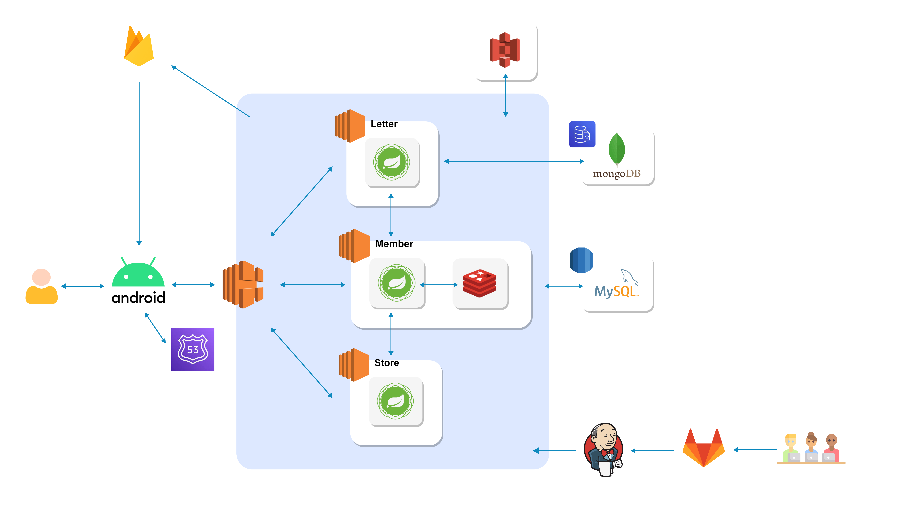
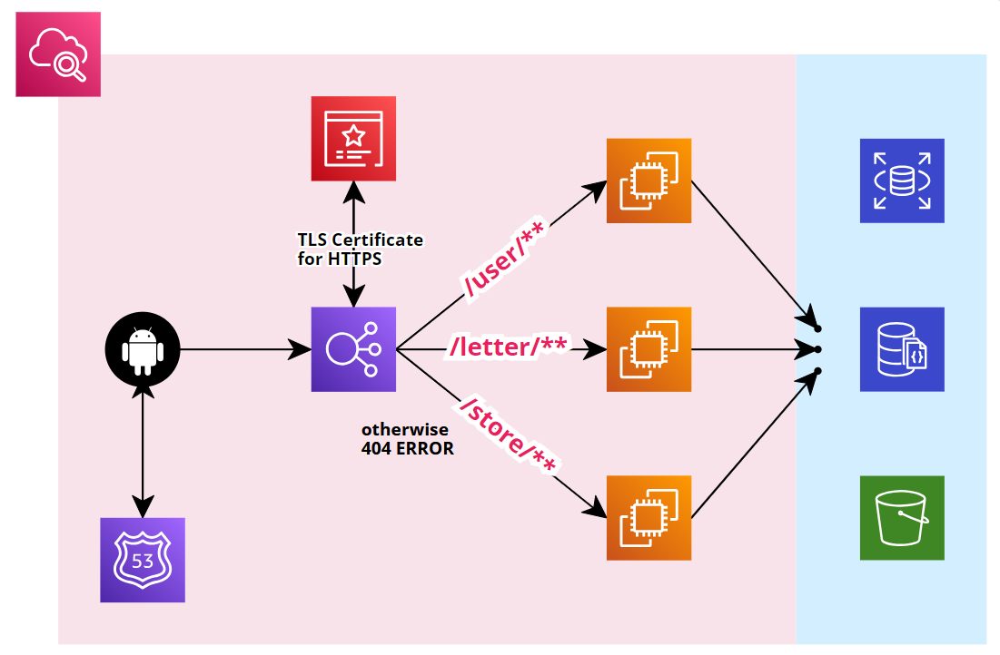

# 0. Version

## Android

| Product | Version |
| :-----: | :-----: |
| Android |  8.1.0  |
| kotiln  | 1.8.10  |
|  hilt   |  2.45   |

## Backend

|      Product      |  Version  |
| :---------------: | :-------: |
| Intellij Ultimate | 2023.2.1  |
|       Java        | 11.0.20.1 |
|    Spring Boot    |  2.7.17   |
|       Redis       |   5.0.7   |
|       MySQL       |  8.0.33   |
|      MongoDB      |   5.0.0   |
|      Jenkins      |  2.414.3  |

## 외부 API

|    Product    | Version |
| :-----------: | :-----: |
| Firebase FCM  | 32.5.0  |
|  Kakao Login  | 2.14.0  |
| Google ARCore |    -    |

# 1. Config

# 2. Architecture



|     Server     | Description |
| :------------: | :---------: |
| Member-Service | 사용자 관리 |
| Letter-Service |  편지 관리  |
| Store-Service  |  상점 관리  |

### `마음길` 서비스의 서버는 위 그림과 같이 MSA 구조로, 총 세 개의 서버가 운영되고 있습니다.

# 1. Build

> 각 서버는 `AWS EC2`를 이용해 배포했습니다. <br>
> 각 서버의 인스턴스 유형은 `t2.medium`입니다.

### 각 서버의 Build 버전 및 사양은 다음과 같습니다.

|  Build  |          Version           |
| :-----: | :------------------------: |
|   OS    | Linux 6.2.0-1015-aws amd64 |
| OpenJDK |         11.0.20.1          |
| Gradle  |            8.3             |
| Groovy  |           3.0.17           |
| Tomcat  |           9.0.82           |
|   Ant   |          1.10.13           |

### Spring Boot 빌드 방법

```shell
#!/bin/bash

# 프로젝트 경로를 변수로 지정
PROJECT_PATH="/your/actual/project/path"

# 프로젝트 경로로 이동
cd $PROJECT_PATH

# Gradle 기반 스크립트에 실행 권한을 부여
chmod +x gradlew

# 프로젝트 빌드
./gradlew clean build

# 빌드된 디렉토리로 이동
cd ./build/libs

# 실행
# --jasypt.encryptor.password=복호화키
# 표준 출력을 output.log 파일로 리다이렉션하고,
# 표준 오류를 error.log 파일로 리다이렉션
nohup java -jar '빌드된 Jar Name' \
--jasypt.encryptor.password=zootopia \
1 > $PROJECT_PATH/output.log 2 > $PROJECT_PATH/error.log %
```

# 2. Deploy

### AWS Deploy Stacks

> 사용한 **AWS 기술 스택**은 다음과 같습니다.

|           AWS Stack            |             Description             |
| :----------------------------: | :---------------------------------: |
|          AWS **EC2**           |          Spring Boot 배포           |
|          AWS **RDS**           |             MySQL 배포              |
|           AWS **S3**           |          이미지 파일 관리           |
|       AWS **DocumentDB**       |            MongoDB 배포             |
|        AWS **Route53**         |              DNS 서버               |
|   AWS **Cerificate Manager**   |          SSL 검증 및 관리           |
| AWS **Elastic Load Balancing** | Load Balancing 및 Service Discovery |
|       AWS **CloudWatch**       |    Application 및 Infra 모니터링    |

### 배포 환경



Request URL: `https://heartpath/`

|   EndPoint   |     Server     |
| :----------: | :------------: |
|  /user/\*\*  |  User-Service  |
| /letter/\*\* | Letter-Service |
| /store/\*\*  | Store-Service  |
|  otherwise   |   404 Error    |

# 3. Config

## User-Service Gradle

```gradle
plugins {
    id 'java'
    id 'org.springframework.boot' version '2.7.17'
    id 'io.spring.dependency-management' version '1.0.15.RELEASE'
}

group = 'com.zootopia'
version = 'SNAPSHOT'

java {
    sourceCompatibility = '11'
}

configurations {
    compileOnly {
        extendsFrom annotationProcessor
    }
}

repositories {
    mavenCentral()
}

dependencies {

    // Spring 관련 Libraries
    implementation 'org.springframework.boot:spring-boot-starter-web'
    implementation 'org.mybatis.spring.boot:mybatis-spring-boot-starter:2.3.1'
    implementation 'org.springframework.boot:spring-boot-starter-data-jpa'
    implementation 'org.springframework.boot:spring-boot-starter-data-redis'
    implementation 'org.springframework.boot:spring-boot-starter-aop'
    implementation 'org.springframework.boot:spring-boot-starter-jdbc'

    // MySQL
    runtimeOnly 'com.mysql:mysql-connector-j'

    // JWT 관련 Libraries
    implementation 'io.jsonwebtoken:jjwt-api:0.11.5'
    implementation 'io.jsonwebtoken:jjwt-impl:0.11.5'
    implementation 'io.jsonwebtoken:jjwt-jackson:0.11.5'

    // Lombok
    compileOnly 'org.projectlombok:lombok'
    annotationProcessor 'org.projectlombok:lombok'
    testCompileOnly 'org.projectlombok:lombok'
    testAnnotationProcessor 'org.projectlombok:lombok'

    // AWS S3
    implementation 'io.awspring.cloud:spring-cloud-starter-aws:2.4.4'

    // XML Processing
    implementation 'javax.xml.bind:jaxb-api'

    // 설정 파일 암호화 Library
    implementation 'com.github.ulisesbocchio:jasypt-spring-boot-starter:3.0.5'

    // swagger
    implementation 'org.springdoc:springdoc-openapi-ui:1.6.14'

    // Firebase
    implementation 'com.google.firebase:firebase-admin:9.2.0'
    implementation group: 'com.squareup.okhttp3', name: 'okhttp', version: '4.2.2'

    // Test
    testImplementation 'org.springframework.boot:spring-boot-starter-test'
    testImplementation 'org.mybatis.spring.boot:mybatis-spring-boot-starter-test:2.3.1'
}

tasks.named('test') {
    useJUnitPlatform()
}

jar {
    archiveClassifier = ''
    enabled = false
}

```

## Store-Service Gradle

```gradle
plugins {
	id 'java'
	id 'org.springframework.boot' version '2.7.17'
	id 'io.spring.dependency-management' version '1.0.15.RELEASE'
}

group = 'com.zootopia'
version = '0.0.1-SNAPSHOT'

java {
	sourceCompatibility = '11'
}

configurations {
	compileOnly {
		extendsFrom annotationProcessor
	}
}

repositories {
	mavenCentral()
}

dependencies {
	implementation 'org.springframework.boot:spring-boot-starter-data-jpa'
	implementation 'org.springframework.boot:spring-boot-starter-data-mongodb'
	implementation 'org.springframework.boot:spring-boot-starter-web'
	implementation 'org.springframework.boot:spring-boot-starter-webflux'
	implementation 'org.hibernate.validator:hibernate-validator:6.2.0.Final'

	// AWS
	implementation 'io.awspring.cloud:spring-cloud-starter-aws:2.4.4'
	// WebClient
	implementation 'org.springframework.boot:spring-boot-starter-webflux'
	// Jasypt
	implementation 'com.github.ulisesbocchio:jasypt-spring-boot-starter:3.0.3'
	// swagger
	implementation 'org.springdoc:springdoc-openapi-ui:1.6.14'
	// firebase
	implementation 'com.google.firebase:firebase-admin:9.2.0'
	implementation group: 'com.squareup.okhttp3', name: 'okhttp', version: '4.2.2'
	// resttemplate
	implementation 'org.apache.httpcomponents:httpcore:4.4.15'
	implementation 'org.apache.httpcomponents:httpclient:4.5.13'

	compileOnly 'org.projectlombok:lombok'
	runtimeOnly 'com.h2database:h2'
	runtimeOnly 'com.mysql:mysql-connector-j'
	annotationProcessor 'org.projectlombok:lombok'
	testImplementation 'org.springframework.boot:spring-boot-starter-test'
	testImplementation 'io.projectreactor:reactor-test'
}

tasks.named('test') {
	useJUnitPlatform()
}
```

## Letter-Service

```gradle
plugins {
	id 'java'
	id 'org.springframework.boot' version '2.7.17'
	id 'io.spring.dependency-management' version '1.0.15.RELEASE'
}

group = 'com.zootopia'
version = 'SNAPSHOT'

java {
	sourceCompatibility = '11'
}

configurations {
	compileOnly {
		extendsFrom annotationProcessor
	}
}

repositories {
	mavenCentral()
}

dependencies {
	implementation 'org.springframework.boot:spring-boot-starter-data-jpa'
	implementation 'org.springframework.boot:spring-boot-starter-data-mongodb'
	implementation 'org.springframework.boot:spring-boot-starter-web'
	implementation 'org.springframework.boot:spring-boot-starter-webflux'
	implementation 'org.hibernate.validator:hibernate-validator:6.2.0.Final'

	// AWS
	implementation 'io.awspring.cloud:spring-cloud-starter-aws:2.4.4'
	// WebClient
	implementation 'org.springframework.boot:spring-boot-starter-webflux'
	// RestTemplate
	implementation 'org.apache.httpcomponents:httpcore:4.4.15'
	implementation 'org.apache.httpcomponents:httpclient:4.5.13'
	// Jasypt
	implementation 'com.github.ulisesbocchio:jasypt-spring-boot-starter:3.0.5'
	// swagger
	implementation 'org.springdoc:springdoc-openapi-ui:1.6.14'
	// firebase
	implementation 'com.google.firebase:firebase-admin:9.2.0'
	implementation group: 'com.squareup.okhttp3', name: 'okhttp', version: '4.2.2'

	compileOnly 'org.projectlombok:lombok'
	runtimeOnly 'com.h2database:h2'
	runtimeOnly 'com.mysql:mysql-connector-j'
	annotationProcessor 'org.projectlombok:lombok'
	testImplementation 'org.springframework.boot:spring-boot-starter-test'
	testImplementation 'io.projectreactor:reactor-test'
}

tasks.named('test') {
	useJUnitPlatform()
}

jar {
	archiveClassifier = ''
	enabled = false
}
```
